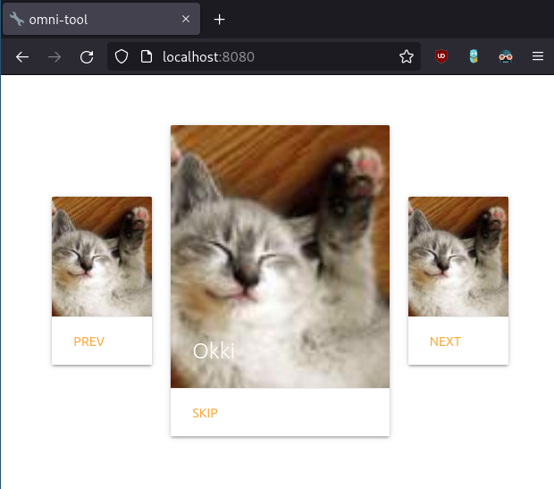

# omni-tool-avatar

## about

this simple tool aids in generating a random order from the configured avatars (user profiles)

## features

   * per-client order: sequence is different and separately maintained for each client
   * templates: client receives a simple static HTML (no javascript)
   * expiry: generated sequence expires after given time
   * persistent: position and sequence persisted even in case of server restart
